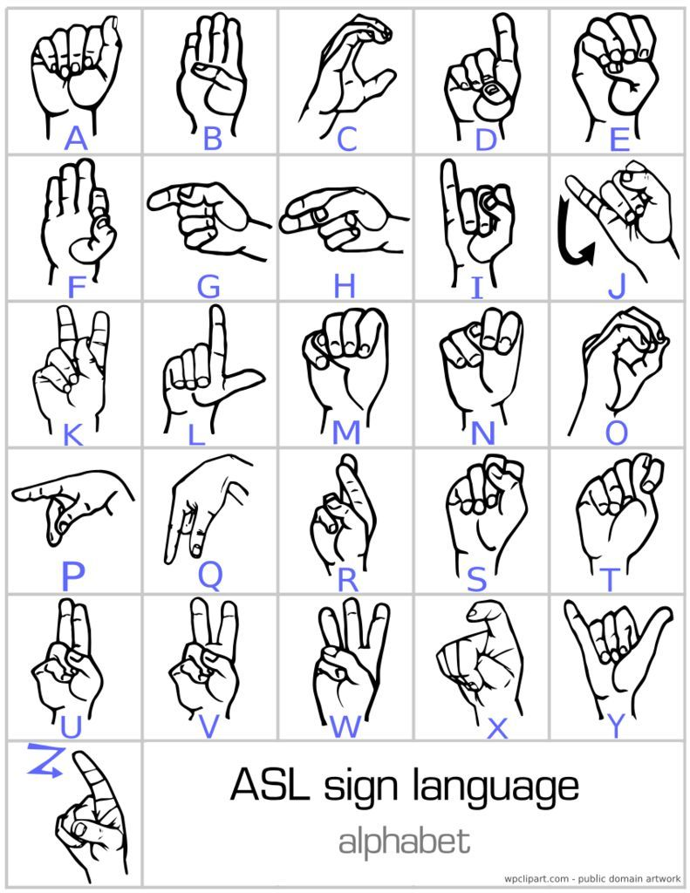
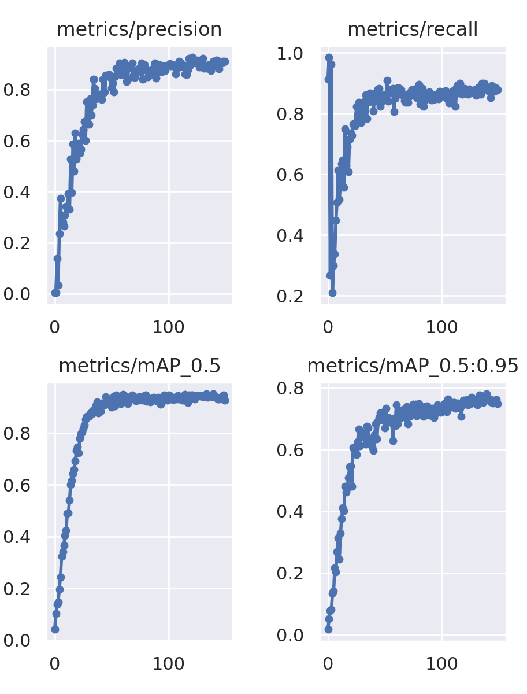
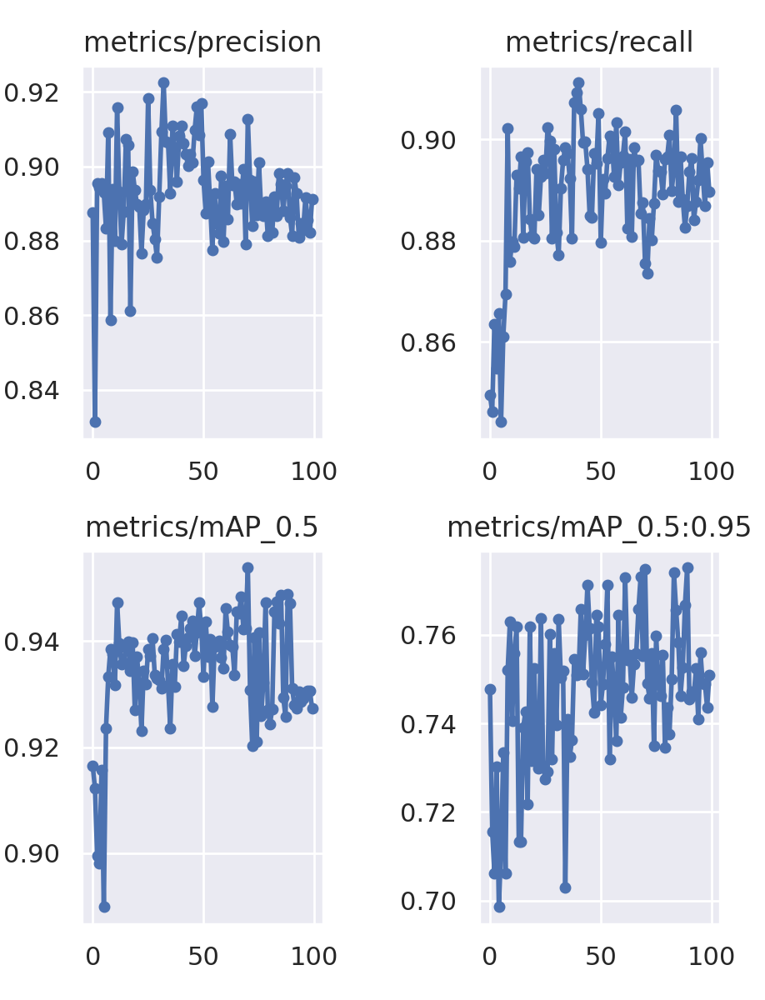
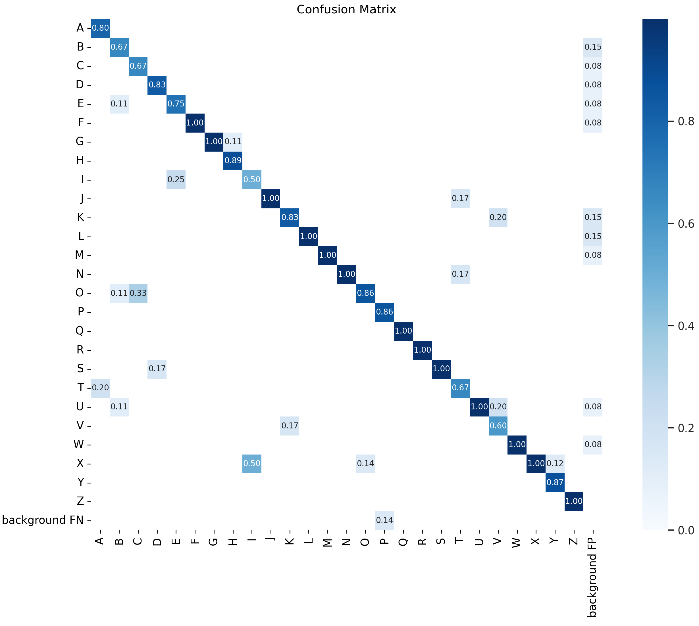
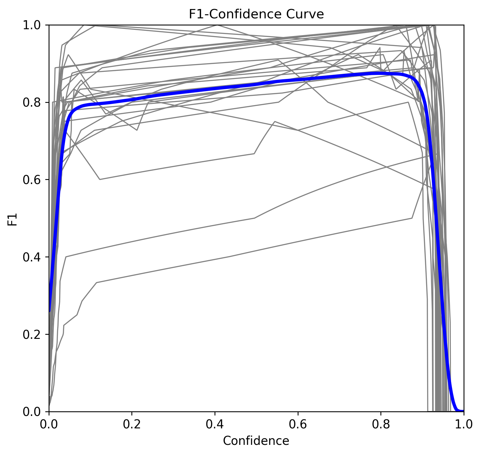
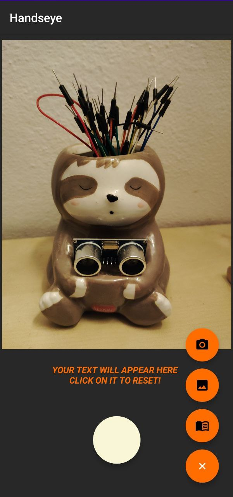
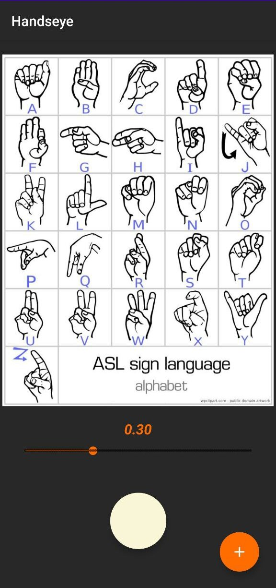
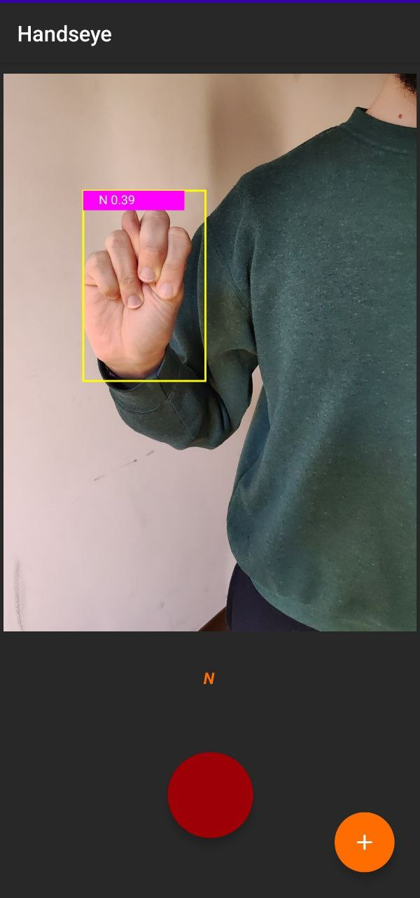

## Introduzione
============

Nella relazione si descriveranno i diversi passi effettuati per lo
sviluppo dell'applicazione: dalla decisione della tecnologia utilizzata
per la detection e classificazione delle immagini, all'implementazione
del software per Android. Il caso d'utilizzo preposto era quello di
riuscire a capire un'intera parola da una persona di fronte alla camera,
che ne mimasse le lettere. Il progetto presenta alcune complessità, di
varia natura, elencate di seguito.

#### ASL

L'alfabeto manuale del linguaggio ASL [@Wikipedia:ASL] comprende le 26
lettere dell'alfabeto americano e i numeri da 0 a 9. I gesti presentano
due criticità: alcune lettere vengono simboleggiate con la mano
posizionata in modo molto simile (es. V & K), mentre altre lettere sono
riconosciute grazie ad un movimento rotatorio della mano (J & Z). Queste
caratteristiche del linguaggio rendono più difficile la classificazione
delle immagini, considerando anche la complessità nel riconoscere la
rotazione della mano. Sono state prese le seguenti decisioni: i numeri
non sono stati considerati parte dell'alfabeto (l'interesse verte sul
riconoscere le parole); le ambiguità tra i simboli sono state ignorate,
procedendo con un approccio empirico nell'allenamento della rete ed una
successiva valutazione sulla precisione; non è stato considerato un
simbolo aggiuntivo di 'spazio' tra le parole, perché fuori dallo scopo
del progetto, ma pur sempre implementabile in futuro.

#### Riconoscimento

Come da premessa, l'obiettivo è l'utilizzo di una rete neurale per il
riconoscimento dei simboli dell'alfabeto. L'opzione di progettare una
rete apposita è stata scartata in principio, preferendo l'utilizzo di
una rete già allenata per la classificazione come base di partenza.
Tuttavia, c'è stato ampio spazio di ricerca tra le reti disponibili che
potessero essere funzionali al progetto, tenendo conto della necessaria
portabilità su sistemi Android.

#### Performance

I dispositivi Android possono essere usati per l'inferenza, ma la loro
capacità computazionale è molto varia (perché dipendente dal loro costo)
e limitata rispetto a computer o sistemi progettati ad-hoc. Inoltre, il
riconoscimento delle lettere deve essere il più veloce possibile, per
garantire una buona esperienza utente. La necessità di bassa latenza in
fase di inferenza è intrinseca al dominio di utilizzo dell'applicazione
ed al sistema target di deployment.

## Sviluppo della rete neurale
===========================

#### Primo approccio e considerazioni
--------------------------------

Uno dei principali motivi che ha spinto lo sviluppo prendendo questo
particolare alfabeto dei segni è la gran disponibilità di dataset
pubblici online. Difatti, è possibile poterne trovare diversi, di
differente varietà, qualità e grandezza. Un primo tentativo è stato
quello di allenare una Convolutional Neural Network, con l'utilizzo di
Tensorflow, utilizzando un dataset molto ampio. Il risultato mostrava
un'altissima confidenza per quello che riguarda le immagini di test,
tuttavia, tramite alcuni test, la grande variabilità dell'utilizzo
finale rendeva questo modello non adatto.

#### Scelta della tecnologia e motivazioni
-------------------------------------

Considerata la necessità di object detection, si è cercato di capire
quale fosse lo stato dell'arte. Grazie a diverse fonti, fra cui i lavori
[@GestureRecognition] ed [@YOLOv5-ASL], si è appreso come l'utilizzo di
una rete YOLO potesse essere la scelta migliore. YOLO (You Only Look
Once) [@YOLO] mira ad effettuare l'object detection come un problema di
regressione, rendendo possibile in un'unica valutazione dell'immagine
l'individuazione della bounding box dell'oggetto e la sua classe di
appartenenza, utilizzando una sola rete. Vanta inoltre ottime
performance, necessarie nel caso d'utilizzo preposto. Fra le varie
versioni disponibili si è scelta la rete YOLOv5, che offre un buon
compromesso fra performance e dimensioni.

La rete YOLOv5 utilizzata è quella fornita da
[Ultralytics](https://docs.ultralytics.com/), implementata con
l'utilizzo di Pytorch, rendendola open source. La versione distribuita è
già pre-allenata utilizzando il dataset COCO (Common Objects in
Context), un popolare dataset general purpose contenente diverse
classificazioni di oggetti comuni. La rete risulta quindi ovviamente da
allenare, essendo nella sua versione base in grado di riconoscere solo
la persona, senza distinguerne la mano o ancor meno il segno espresso.

Il dataset scelto [@Dataset] è composto da 1728 immagini, annotate
appositamente per la rete YOLOv5. Una parte del dataset è stato ricavato
ramite tecniche di Data Augmentation, tramite flip orizzontali
dell'immagine, diverse rotazioni e altre manipolazioni.

### Risultati
---------

La rete YOLO è stata allenata con il dataset scelto, 150 epoche ed i
pesi iniziali dati da YOLOv5s6. Dopo aver effettuato il training, si
sono ottenuti i risultati riportati in Figura
[2](#fig:training){reference-type="ref" reference="fig:training"}.

Dalla Figura [2](#fig:training){reference-type="ref"
reference="fig:training"} si può notare come precision e recall mostrino
risultati soddisfacenti, entrambi sopra lo 0.8. In seguito, sono stati
migliorati effettuando la fase di fine-tuning (Figura
[3](#fig:fine_tuning){reference-type="ref"
reference="fig:fine_tuning"}).

Dopo aver effettuato train e fine-tuning della rete YOLO, si è ricavata
la matrice di confusione di Figura
[4](#fig:conf_mat){reference-type="ref" reference="fig:conf_mat"}.

#### Commento

La rete ha generalmente un buon livello di precisione. Le lettere che
presentano bassi valori non sorprendono, poichè simili ad altre o
particolari, ad esempio:

-   la lettera I viene spesso confusa con la X, con un tasso molto alto
    di 0.50, il peggior risultato.

-   la lettera C, viene confusa con la lettera O nello 0.33 dei casi: le
    lettere sono molto simili, entrambe hanno una mano a cerchio, ma
    nella O le estremità si chiudono.

-   la lettera A con la T, con un tasso del 0.20: si distinguono per la
    sola posizione del pollice, entrambe a pugno chiuso, similmente alla
    K e alla V.

Dalla curva F1-score/Confidence in Figura
[5](#fig:f1){reference-type="ref" reference="fig:f1"} il valore di
confidenza che ottimizza la precision e recall è 0.796, con F1-score
pari a 0.87.

#### Testing

La rete YOLO è stata poi testata utilizzando la webcam del computer,
dando risultati molto soddisfacenti. Le lettere vengono riconosciute con
una percentuale di confidenza alta (come da grafici) e velocemente,
riuscendo a mantenere un alto frame rate. Inoltre, il modello risulta
sufficientemente robusto a condizioni differenti di luce e distanza
della mano dalla webcam.

## Porting mobile
--------------

#### Pytorch

Il framework di machine learning utilizzato in Handseye è Pytorch
Mobile, che tuttavia non supporta nativamente il modello allenato e
testato su computer. L'interprete utilizzato dal framework su Android
supporta i modelli in versione Torchscript.

#### Export

L'implementazione di Ultralytics offre la possibilità di esportare il
proprio modello in diversi formati, tra cui appunto il formato
Torchscript supportato dal lite-interpreter. Oltre all'esportazione è
anche necessario ottimizzare il modello per l'inferenza su dispositivi
mobili, tramite una chiamata a funzione.

#### Testing

Il modello esportato è stato testato su più dispositivi Android.
Contrariamente al modello iniziale, Il processo di inferenza su
smartphone è più lento e la certezza nella classificazione delle lettere
è drasticamente diminuita. Nonostante ciò, il modello rimane capace di
riconoscere correttamente i gesti della mano in un sufficiente numero di
casi. Un'ulteriore criticità è lo spazio necessario per salvare il
modello su smartphone.

## Sviluppo dell'applicazione
==========================

In linea con il programma del corso, è stato scelto di sviluppare
un'applicazione per Android con l'utilizzo dell'IDE Android Studio. Come
linguaggio è stato scelto Kotlin, linguaggio multi-paradigma ed open
source sviluppato da JetBrains sempre più utilizzato ed affermato nello
sviluppo di applicazioni.

#### Funzionalità

Lo scopo principale dell'applicazione è quello di rendere possibile il
riconoscimento di una parola da una mano che mima le lettere
dell'alfabeto ASL. Inoltre, sono state aggiunte alcune semplici
funzionalità per comodità dell'utente, accessibili tramite un Floating
Button, in ordine:

-   La possibilità di accedere alla fotocamera per effettuare una
    singola foto da analizzare.

-   L'accesso alla galleria per selezionare un'immagine già acquisita di
    cui capire la lettera.

-   La possibilità di visualizzare una pagina descrittiva dell'alfabeto,
    insieme ad una barra per impostare il limite di confidenza
    desiderato.

Il risultato dell'analisi appare sotto l'immagine in un'apposita Text
Box.

In Figura [6](#fig:app_interface){reference-type="ref"
reference="fig:app_interface"} l'interfaccia di Handseye. Appena aperta
l'applicazione, la fotocamera viene accesa. Il Floating Button (qui
premuto) mostra i pulsanti per accedere alle altre funzionalità. Il
pulsante centrale bianco serve per avviare l'analisi live di ciò che
viene visualizzato dalla fotocamera, quando attiva, il pulsante diventa
rosso. In Figura [8](#fig:app_letter){reference-type="ref"
reference="fig:app_letter"} un esempio di gesto riconosciuto durante
l'analisi live da smartphone.

Se viene caricata o scattata un'immagine questa viene analizzata
direttamente.

Cliccando l'icona del libro apparirà l'interfaccia in Figura
[7](#fig:app_book){reference-type="ref" reference="fig:app_book"}. La
barra sottostante l'immagine permette la configurazione della threshold
con cui si vuole analizzare l'input.

#### Commento

Dato il drastico calo di performance del modello YOLO su mobile, alcuni
accorgimenti sono stati presi per rendere più semplice il riconoscimento
di una parola: solo il risultato con la migliore confidence
dell'immagine viene visualizzato, sia tramite bounding box che nel
testo, scartando altri possibili errori. Notare che ciò è comunque in
linea con il caso di utilizzo, che prevede una sola persona (quindi una
sola mano) a mimare la parola. Inoltre, vengono visualizzati solo i
risultati che permangono per più 3 frame, per eliminare il più possibile
risultati spuri dati da inesattezze e movimenti della mano nel passaggio
da una parola all'altra.

## Conclusioni 
===========

L'obiettivo è stato raggiunto, l'applicazione funzionante riesce a
capire un'intera parola mimata da una mano con l'alfabeto dei segni
americano. Tuttavia, rispetto alle performance ottenute dal modello
originale, il modello YOLO esportato per mobile riduce drasticamente la
precisione, rendendo non sempre facile capire con esattezza la parola
corretta.

#### Possibili sviluppi futuri

Un possibile sviluppo potrebbe essere quello di migliorare il modello di
rete neurale utilizzato, provando altre tecnologie o un diverso dataset.
Inoltre, un'estensione che potrebbe migliorare l'esperienza utente
potrebbe essere l'inserimento di uno Spell Checker, che suggerisca o
preveda una parola simile all'input fornito. Lo Spell Checker potrebbe
essere progettato tenendo conto dei dati rilevati dalla matrice di
confusione, per limitare quanto possibile gli errori della rete.

## Link risorse esterne
====================

-   [Progetto](https://github.com/hiaripc/Handseye):
    github.com/hiaripc/Handseye

-   [YOLOv5](https://github.com/ultralytics/yolov5):
    github.com/ultralytics/yolov5

-   [Dataset](https://public.roboflow.com/object-detection/american-sign-language-letters/1)
    [@Dataset]

Hu, D., Zhu, J., Liu, J., Wang,J., Zhang, X.: Gesture recognition based on modifiedyolov5s. IET Image Process. 16, 2124--2132 (2022); https://doi.org/10.1049/ipr2.12477 

T. F. Dima and M. E. Ahmed, \"Using YOLOv5 Algorithm to Detect and Recognize American Sign Language,\" 2021 International Conference on Information Technology (ICIT), 2021, pp. 603-607, doi: 10.1109/ICIT52682.2021.9491672. 

J. Redmon, S. Divvala, R. Girshick, A. Farhadi : \"You Only Look Once: Unified, Real-Time Object Detection\"; arXiv:1506.02640 

Lihi Gur Arie, PhD: \"The practical guide for Object Detection with YOLOv5 algorithm\"; towardsdatascience.com/the-practical-guide-for-object-detection-with-yolov5-algorithm-74c04aac4843.

Wikipedia: \"American Sign Language\"; https://en.wikipedia.org/wiki/American\_Sign\_Language 

David Lee, \"American Sign Language Letters Dataset\", public.roboflow.com/object-detection/american-sign-language-letters
