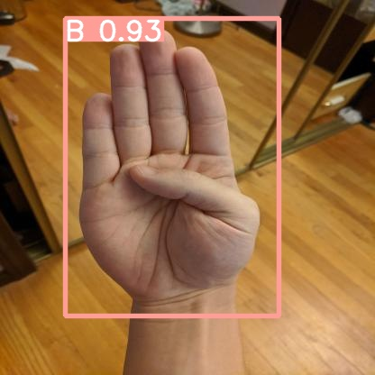
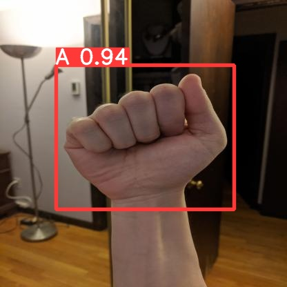
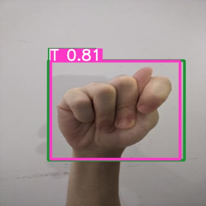
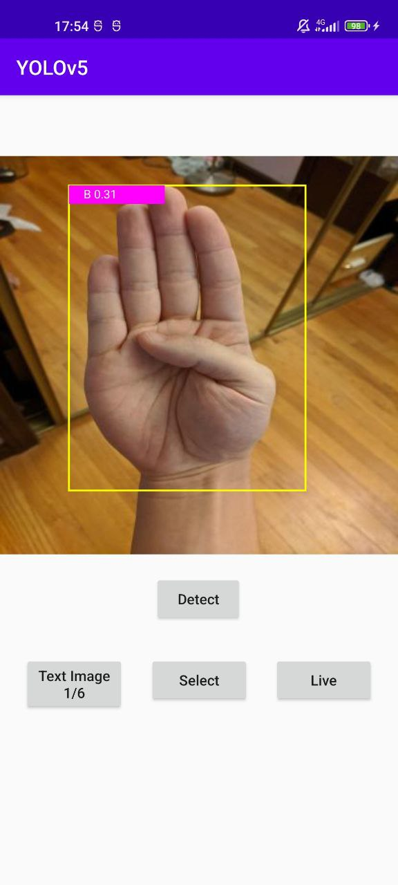
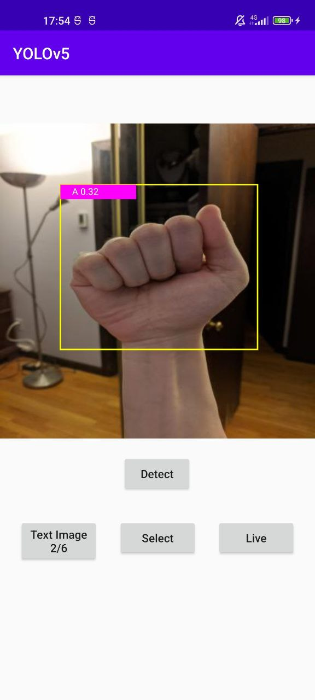
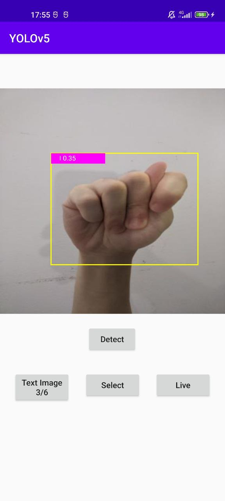

# Handseye
Handseye is an Android App (in development) which uses AI techniques to output the letters, represented with human hands, perceived by the smartphone's camera.

## Butto giù tutto quello che mi passa per la mente:
Il primo tentativo di costruzione della CNN (nella cartella c'è un README che la riassume) riesce a riconoscere con una teorica accuratezza del 100% le lettere dalle mani, isolate. Una principale problematica sarà il dover riconoscere e localizzare la mano all'interno di un immagine che non contiene solo la mano (una persona intera? più persone? vogliamo un use case preciso o espanderlo a più casi possibili?), per poi darla alla cnn che è solo un puro riconoscitore. 
Bisognerà capire se è l'approccio giusto e come fare ciò.
Per ora immagino una sorta di due fasi, prima un filtro che localizza la mano (o le mani) poi la cnn.

Leggendo [questo articolo]( https://appsilon.com/object-detection-yolo-algorithm/#:~:text=YOLO%20%E2%80%9CYou%20Only%20Look%20Once,by%20Joseph%20Redmon%20et%20al ) mi sembra di capire che questo sia un approccio un po' meh. Ovvero sarebbe un approccio basato sulla classificazione.
A quanto pare un altro approccio più semplice è dato dalla regressione, che permette di trovare gli elementi d'interesse nell'immagine direttamente. L'algoritmo YOLO, che sempre una rete neurale è, (che in un'unica iterazione fa l'object detection) è esattamente uno di questi algoritmi, che potremmo provare a usare. Darknet è una delle sue implementazioni open source.
La YOLOv5 è implementata con Pytorch, una sua implementazione opensource è data da [ultralytics]( https://docs.ultralytics.com/).
[Installazione](https://pytorch.org/hub/ultralytics_yolov5/), all'interno trovi un file jupyter notebook di tutorial.

P.s.....  ENVIRONMENT....... occhio a scheda grafica, ho dovuto provare tutte le possibili combinazioni possibili prima di trovare un cudatoolkit che funzionasse. Per me, che ho la versione cuda 11.4 (controlla con comando nvidia-smi) è funzionato l'11.3. Comunque consiglio molto di fare ambiente conda a parte. Inoltre ti consiglio di fare tutto in un bel conda apposito per l'occasione. Altra problematica: jupyter notebook potrebbe avere dei problemi a riconoscerti i moduli installati nell'ambiente conda, prova [qui](https://stackoverflow.com/questions/39604271/conda-environments-not-showing-up-in-jupyter-notebook). Il vantaggio di usare jupyter sta nel poter eseguire singole parti del codice python separatamente tenendo in memoria le altre, niente male se vuoi lavorare sui risultati senza doverti rifare tutto il train.

Non capisco se sia di facto "indispensabile" o solo un modo di approcciare, però mi sembra il più semplice.

Per ora, immagino la possibilità di usare YOLO per trovare la mano, poi passare il frame tagliato alla nostra CNN home made.


Su Roboflow ho trovato [un progetto]( https://github.com/insigh1/Interactive_ABCs_with_American_Sign_Language_using_Yolov5) che di facto fa quello che vorremmo fare. 

Penso che studiarcelo sia un ottima cosa da fare, anche perchè comunque a noi mancherà tutto il porting su android che non penso sia da poco.. Inoltre dalle conclusioni a cui è arrivato pare che il tutto non sia così facile. Il suo modello ha comunque molte difficoltà ad identificare mani che non siano su uno sfondo molto bianco. Potremmo provare a prendere qualche spunto e tentare di migliorare quel che riusciamo.
Da notare che il suo dataset era molto distretto (720 immagini, che ha aumentato ricavandone 25 in più da ognuna con data augmentation), magari noi con dataset più grandi potremmo ottenere risultati migliori. Fa però notare che i dataset trovati avevano basse definizioni, per questo lui se lo è creato con aiuto dei social.

P.s. Roboflow è un sito che permette anche di crearsi i propri dataset e di fare image labeling, vedo che diversi articoli che incontro lo usano, magari ci tornerà utile.

Da un primissimo approccio un po' random a Yolov5 utilizzando la webcam non riconosce le mani a sè, ma come persona. Le dita poi spesso sono spazzolini, coltelli o hotdog. Penso che di base sia allenata su COCO dataset, che ha un certo numero di classi generiche, ma sicuramente ci sarà da allenarla con un bel dataset.

[Un paper carino](https://www.researchgate.net/profile/Eleas-Ahmed/publication/353489194_Using_YOLOv5_Algorithm_to_Detect_and_Recognize_American_Sign_Language/links/61c066c5fd2cbd7200b26ebb/Using-YOLOv5-Algorithm-to-Detect-and-Recognize-American-Sign-Language.pdf) da cui mi sembra di capire che l'approccio con Yolo sia effettivamente il più saggio essendo veloce e leggero (quindi anche deloyable su smartphone).

Qui usano un approccio totalmente basato su Yolo inquadrando però direttamente la sola mano, quindi non per object detection della mano (non so se funzionerebbe anche su immagini più lontane, non credo) ma per riconoscere il simbolo che rappresenta, più semplice del nostro use case. Andrà capito se conviene usare una Yolo anche a valle per capire il simbolo o usarla solo per passare la patch della manina generica a una nostra CNN apposita.

Potremmo anche pensare di creare un nostro semplice dataset per semplificarci un po' la vita come fa [questo simpatico indiano]( https://www.youtube.com/watch?v=1amn2nlYdSs). Si filma dalla webcam mentre fa i segni, poi frame per frame fa il labelling e poi si allena la sua Yolo. Penso che sia un approccio molto semplice ma molto specifico, che potrebbe avere problemi di adattamento ad altri mani/persone/ambienti. Potrebbe però essere una possibile strada. 
In realtà anche il primo esempio non ha un approccio molto differente.

[Guida](https://towardsdatascience.com/the-practical-guide-for-object-detection-with-yolov5-algorithm-74c04aac4843)per il training di Yolov5, per capire meglio: [differenza fra batch ed epoch, SGD](https://machinelearningmastery.com/difference-between-a-batch-and-an-epoch/), a proposito di batch size: va bene mettere il valore più alto che l'hardware regga a livello di memoria, per me 16 con dataset roboflow mi riempiono già un 90% di ram (da 16GB). 
Leggendo, si capisce che si può procedere o facendo un training da zero, migliore se si ha un buon dataset, oppure partire da un modello (passandolo in input come i pesi iniziali) e modificarlo. Anche qui ci sarà da scegliere in base a ciò che faremo.

Ora 12.30 del 27/08 ho iniziato il training della rete, 150 epoche. Ci metterò qualche ora mi sa....
Ho finito due ore e mezza dopo. Ho caricato la rete risultante nella cartella yolo_first_try. All'interno ci sono vari grafici eccetera. L'ho costruita con il comando che trovi nel file code.ipynb nella cartella.

Non sono partito da scratch per allenarla, ma da yolov5s6 (parametro weights) che già riconosce un certo numero di classi. Non so se convenga o no ai fini del risultato anche perchè a noi serve solo la mano.
Come si può vedere dai grafici i risultati sembrano buonissimi. Nella tabella finale mi dà una precisione media di 0.9, che raggiunge 1 per certe lettere e scende ad 0.75 nei casi peggiori. 

Ora manca la fase di Fine Tuning e di Validation. Comunque i risultati con la webcam e una luminosità meh sono già stra buoni

## 06SET2022 - APP
Il modello è stato importato nell'applicazione e reso funzionante, tuttavia la funzione di object detection in tempo reale è lenta e molto imprecisa. Da notare che non è stato completato il processo di Fine Tuning, Validation, e Quantizzazione della nostra rete.
Per **esportare il modello** in una rete utilizzabile su mobile (PyTorch mobile) è stato necessario il file export.py (leggermente modificato, vedi readme [Object Detection](https://github.com/pytorch/android-demo-app/tree/master/ObjectDetection)) della libreria ultralytics/yolov5.
Esempio: python3 **export.py** --weights path-to-file.pl --optimize --include torchscript

Informazioni su object detection in tempo reale e su foto salvate su disco possono essere trovate nel progetto appena linkato. Tuttavia, il codice per effettuare l'analisi delle immagini è stato completato seguento questa [Guida sullo sviluppo di applicazioni che usano la CameraX](https://developer.android.com/codelabs/camerax-getting-started). La fase di interesse è ImageAnalysis.

Da tenere aperto è il discorso Tensorflow vs Pytorch, non ho letto abbastanza e non so quale sia più performante/leggero. Potrebbe essere anche utile provare l'applicazione su telefoni più performanti del mio.

Nel codice ci sono tante **Safe o Null Checked calls**, essendo nuovo a Kotlin non ho un opinione a riguardo ma suppongo che strutturare il codice in modo diverso per toglierle sia una soluzione più pulita.

Riguardo a come debba funzionare l'applicazione, ho provato anche a **scattare e salvare una foto** per poi fare OD (modello yolov5s), con l'idea di non tenere attiva sempre la rete. Ci sono due problemi: salvare una foto aggiunge una latenza non indifferente il che causa problemi (rende impossibile questo approccio), e la rete deve essere sufficientemente veloce e precisa altrimenti si rischia di scattare una foto che non offre un risultato o ne offre uno errato.

Nel progetto viene usiato il [ViewBinding](https://developer.android.com/topic/libraries/view-binding), uno strumento che rende più automatizzato il recupero dei widget delle view sul codice Kotlin/Java.

## 08SET2022 - MODELLO E APP
Il nostro modello personalizzato ha passato anche le fasi di fine tuning e validation. La precisione della rete è migliorata, ma dalla matrice di confusione si possono notare alcuni problemi nell'identificazione di certe lettere, probabilmente qualcosa andrà fatto. I risultati di questi processi si trovano nella cartella cnn/yolo-finetuned. Non sono pienamente soddisfatto comunque, chissà se sarà necessario fare qualcosa al dataset oppure allenarlo direttamente con un dataset più ampio.

Per quanto riguarda l'applicazione, la precisione non sembra buona e il tempo di detection nemmeno. Non capisco la motivazione del primo problema, mentre per risolvere il secondo dovremo applicare qualche tecnica di quantizzazione (statica o dinamica, ad [esempio](https://pytorch.org/tutorials/advanced/static_quantization_tutorial.html)).


## 21SET22 - Tentativo miglioria con size

Un problema emerso riguardo la precisione potrebbe essere quello dell'image size. Con il detect di yolo, tutte le immagini passate alla rete hanno dimensione 640x640 in ingresso, allargando le immagini di test del dataset che hanno dimensione 419x419 Da webcam del pc utilizza invece 640x480, funzionando comunque bene.
Guardando la [documentazione di camerax](https://developer.android.com/training/camerax/configuration) ho provato a settare size a 640x480, anche se in realtà c'è scritto che Image Analysis utilizza questa dimensione di default. 

## 22SET22 - un brevissimo recap e strada da fare:
L'applicazione base c'è. Tuttavia ha performance pessime.
Per risolvere e capire bene qual è il punto di rottura, si applica il bel principio KISS (Keep it Simple, Stupid).

Iniziamo con il semplificare al massimo l'applicazione: deve scattare una foto (o caricarla dalla galleria) e fare la detect su quella, dando il risultato. Così si potrà capire a quale punto le cose smettono di funzionare. In particolare,le domande a cui rispondere:
    - E' un problema hardware? (Probabilmente no, dovrebbe solo impiegarci di più)
    - Il porting nella versione lite?
    - Le performance richieste dal real time detenction? (Probabile, visto hardware meno performante)
    - Problemi di scala della camera? (Possibile)

Una volta risposte queste domande e risolto il problema, ci si potrà concentrare sulle due migliorie possibili: l'app (che al momento sarà super basic) e la cnn, di cui sarà da capire il limite e se possiamo migliorarla (magari un altro dataset). Poi rendere l'app carina e capire cosa possiamo permetterci di fare.

## 22SET22 - KISS
Primo tentativo (di successo) 'TheSimpleApp': utilizzando [Object Detection](https://github.com/pytorch/android-demo-app/tree/master/ObjectDetection) applicazione ultra basic del tutto simile al risultato intermedio che si vuole, cambiandole cnn. E' bastato seguire la semplice guida del link ma NB!!! è necessario nella build gradle mettere la versione 1.12 di torch lite altrimenti non va (il nostro modello è troppo recente per la 1.10).

**Risultato**
Utilizzando le immagini di test del dataset il risultato è pessimo. Esempio: le lettere A e B sono riconosciute con una confidence di 0.30 (bassissima) e la M è confusa con una i. 
Risposta alle domande: il problema non era legato al real time, nè a problemi di scala. Rimangono valide hardware e porting nella versione lite.
Difatti, utilizzando il modello del momento abbiamo dei risultati molto buoni sulle immagini del test effettuato con: il comando (dalla cartella yolo)
```
python detect.py --source 'dataset/test/images' --weights 'handseye/0.0_cnn/fine-tuning-07092022/weights/best.pt'
``` 

Il risultato è nella cartella relationMaterial/exp2209.
Ad esempio: 




Hanno tutte e tre una buona confidenza e un buon risultato.
Tuttavia le stesse tre immagini provate all'interno dell'app caricate come immagini di test danno pessimi (se non sbagliati) risultati.






